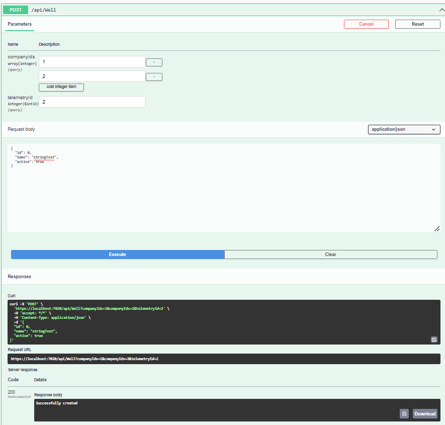

**Key technologies:** *ASP.NET Core Web API, React, NET 7, C#, Typescript, Sqlite, Entity Framework, CRUD, HttpClient*

## Information
CRUD operations in API. Server(API) and client (React) connection using HttpClient.

## Server(API) and client connection using HttpClient.
### Server, WPF, Concole App
Server: ASP.NET Core Web API, Client: React

## CRUD operations in API

### The structure of DataBase

### Swagger (as Postman)

### Get

### Post

### Put

### Delete

